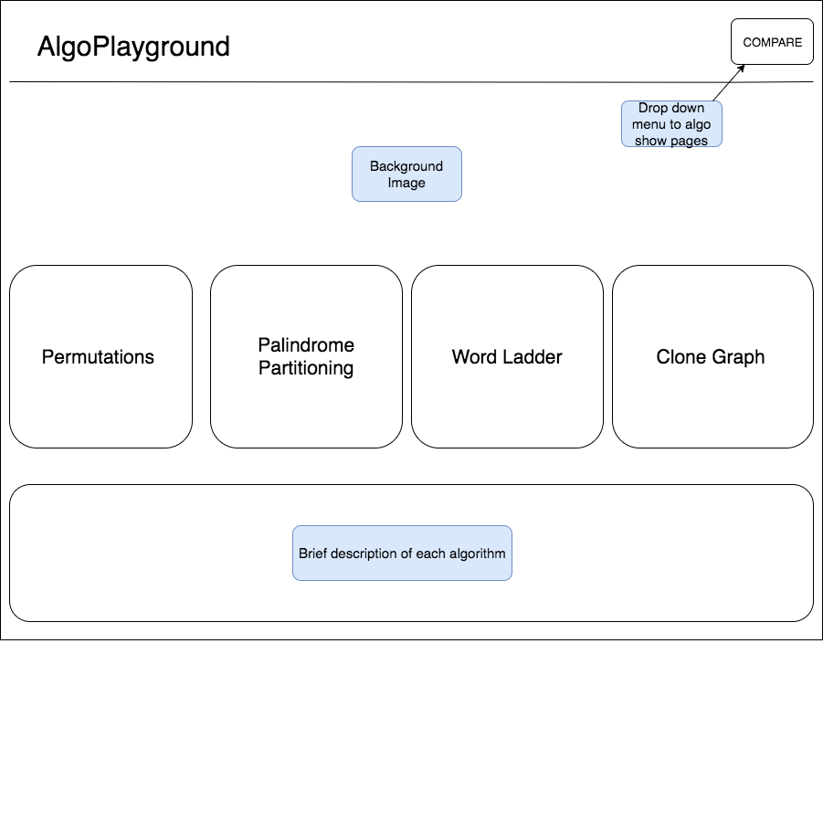
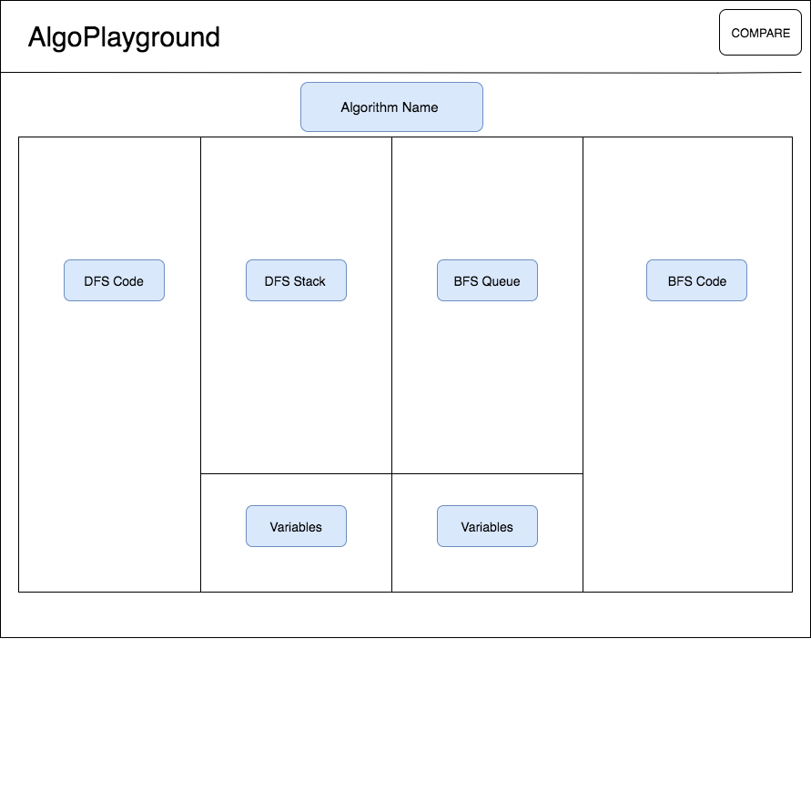
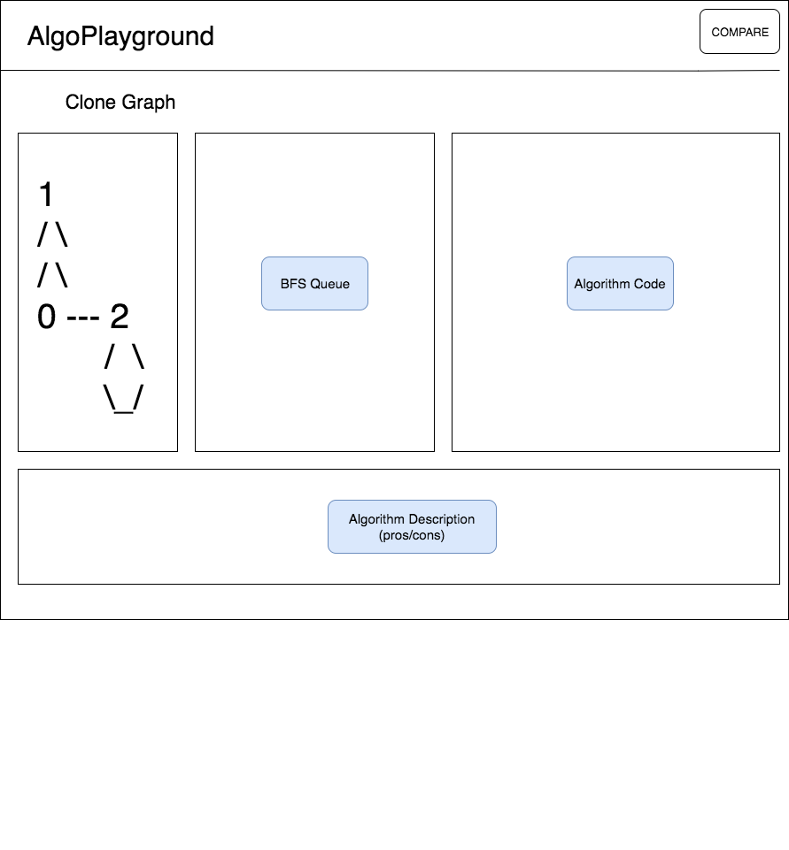
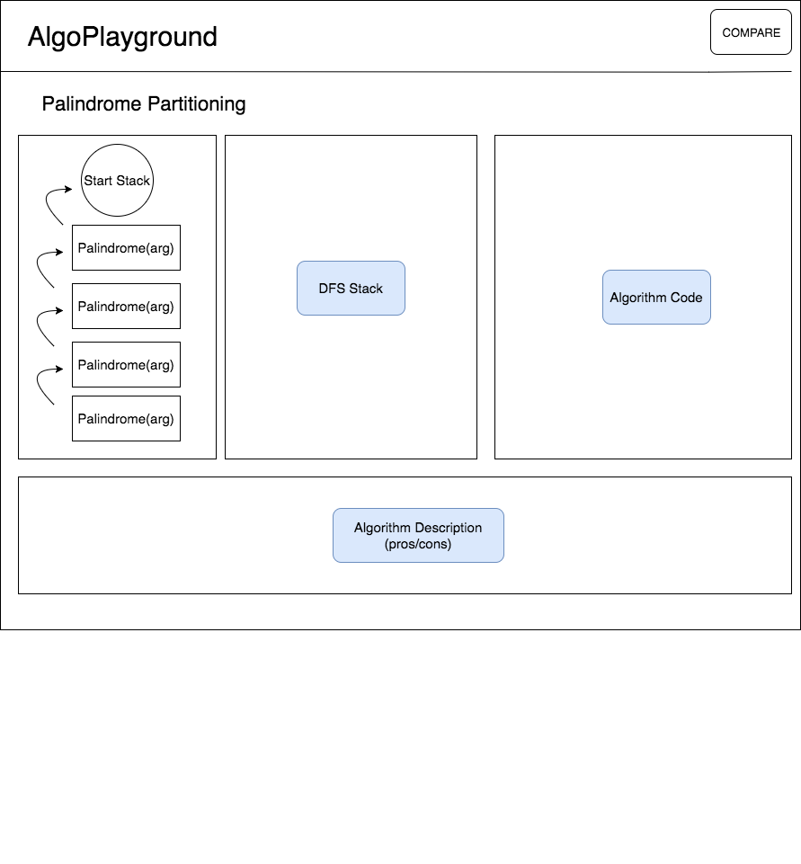

# AlgoPlayground

### AlgoPlayground is an online platform that can execute and visualize BFS/DFS algorithms.

## Background and Overview

Algorithm traversal methods have benefits and drawbacks some of which are not immediately apparent. AlgoPlayground will visualize and compare traversals for breadth first search (BFS) and depth first search (DFS). The intent is to give the user a better understanding of not only the traversal but how the search interacts in memory. The relative data structures for each algorithm will be displayed alongside a highlighted path to track the traversal.

## Functionality & MVP

   - [ ] Highlight the path as the algorithm traverses step by step
   - [ ] Visual display for the call stack and relevant variables
   - [ ] Comparison of DFS / BDS of the same algorithm on one page

#### Bonus Features
   - [ ] Color the node or edge of the clone graph as the algorithm is being executed
   - [ ] User can write and execute their own code
   - [ ] Compare space and time complexity

## Wireframes

Homepage displays all available algorithms along with brief descriptions.

For the permutations and word ladder algorithms the show page will give in depth visualization of DFS and BFS.

## Technologies & Technical Challenges
  ##### Backend: Python/Django/AWS/PostgreSQL
  ##### Frontend: React/JavaScript/HTML 5/CSS/

  This website will utilize a Python/Django backend with a PostgreSQL database. Challenges will arise when trying to gain conceptual knowledge of the chosen algorithms. Usage of AWS with a Django/Python stack will also likely prove difficult.

## Accomplished over the Weekend
 - Chose our algorithms based on frequency and implementation methods
 - Setup Django backend and deployed on AWS
 - Created and tested a Github repository to ensure proper collaboration
 - Scheduled scrum plans and an algorithm white-boarding schedule

## Group Members & Work Breakdown

**Yang Shen**,
**Nicholas Cannon**

### Day 1
  - Build out main page skeleton **Nick**
  - Highlight the algorithm path **Yang**
  - White board permutations with DFS **Yang**
  - White board permutations with BFS **Nick**

### Day 2
  - Visual call stack logic **Yang**
  - Visualize relevant variables **Nick**

### Day 3
  - Finish visual call stack logic **Yang**
  - Finish visualization relevant variables **Nick**
  - White board word ladder with DFS **Yang**
  - White board word ladder with BFS **Nick**

### Day 4
  - Clone graph visualization **Yang**
  - Palindrome partitioning visualization **Nick**
  - Begin CSS style each page

### Day 5
 - White board clone graph with DFS **Yang**
 - White board palindrome partition with BFS **Nick**
 - Clean up CSS styling
